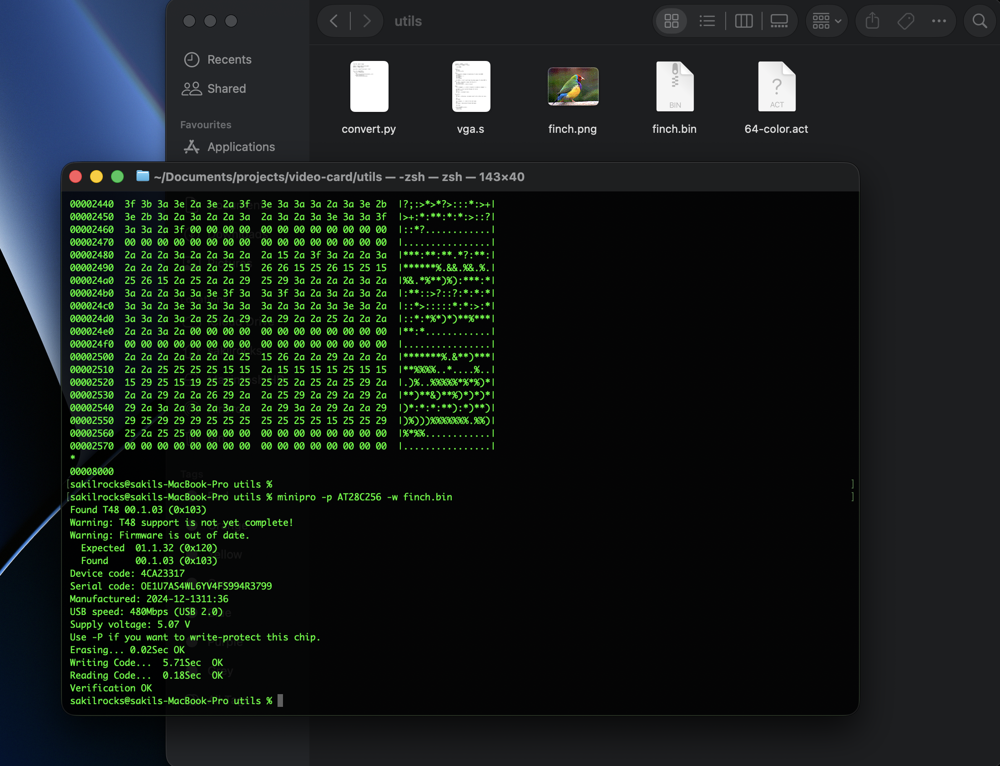
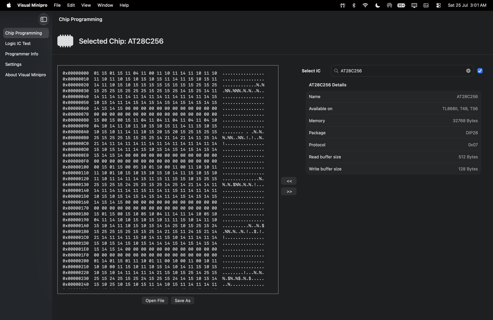

# video-card

*a video card built entirely from 74-series TTL logic ICs, capable of generating an **800 × 600 @ 60 Hz SVGA** video signal without the use of a microcontroller, FPGA, or dedicated graphics processor.*


---

## Overview

This project is built entirely from discrete TTL logic integrated circuits. The design generates SVGA synchronization signals, produces pixel 
addresses using hardware counters, and retrieves image data directly from an **AT28C256 EEPROM** to display graphics on a standard VGA monitor.

Unlike modern graphics hardware, every aspect of the video generation process is implemented using fundamental digital logic, including timing
generation, address calculation, memory access, and RGB output. Building this project provided a practical understanding of computer graphics,
digital electronics, memory systems, and synchronous circuit design.

---

## Features

* VGA signal generation using discrete TTL logic
* 800 x 600 @ 60 Hz compatible output
* Hardware generated horizontal and vertical synchronization
* EEPROM based image storage
* Pixel data fetched directly from ROM
* Built using standard 74LS and 74HCT logic ICs
* No microcontroller, FPGA, or programmable logic devices (PLDs)
* Programmed using a T48 EEPROM programmer and Minipro

---

## How It Works

The video card operates by generating pixel addresses synchronized with the SVGA timing specification.

A 10 MHz oscillator provides the master clock for the circuit. Cascaded binary counters generate the horizontal and vertical pixel positions.
Additional combinational logic detects synchronization intervals and produces the **HSYNC and VSYNC signals** required by the monitor.

The current pixel coordinates are translated into an address within the *AT28C256 EEPROM*. Each memory location stores colour information for a
single pixel. The EEPROM outputs these bits continuously as the counters advance, producing a complete video frame line by line.

This process repeats continuously at the VGA refresh rate, allowing the stored image to be displayed without any software running after power up


The design is derived from the standard **800 × 600 @ 60 Hz SVGA** timing specification. Instead of using the standard **40 MHz pixel clock**,
the circuit operates from a **10 MHz clock**. To preserve the required horizontal and vertical scan frequencies, each logical pixel is held for
4 clock cycles while the horizontal timing parameters are proportionally scaled. This results in a scan frequency of approximately **37.88
kHz** and a refresh rate of approximately **60 Hz**, allowing the monitor to correctly synchronize with the generated video signal.


**The timing parameters for the project are:**

| Parameter | Value |
|-----------|-------|
| Stored Image Resolution | 100 × 75 pixels |
| Display Resolution | 800 × 600 @ 60 Hz |
| Pixel Clock | 10 MHz |
| Horizontal Total | 264 clock cycles |
| Visible Horizontal | 200 clock cycles (800 displayed pixels) |
| Vertical Total | 628 lines |
| Visible Vertical | 600 lines |
| Horizontal Sync Pulse | 32 clock cycles |
| Vertical Sync Pulse | 4 lines |

### Horizontal timing:
```
Visible Area     : 200 clocks
Front Porch      : 10 clocks
Sync Pulse       : 32 clocks
Back Porch       : 22 clocks
-----------------------------
Total            : 264 clocks
```

**At a 10 MHz clock:**
* One pixel clock = **100 ns**
* One scanline = 264 × 100 ns = **26.4 µs**
* Horizontal frequency = **10 MHz / 264 ≈ 37.88 kHz**

### Vertical Timing:
```
Visible Area     : 600 lines
Front Porch      : 1 lines
Sync Pulse       : 4 lines
Back Porch       : 23 lines
-----------------------------
Total            : 628 lines
```
**With a line time of 26.4 µs:**

* Frame time = **628 × 26.4 µs ≈ 16.58 ms**
* Refresh rate ≈ **60.3 Hz**
---

## Hardware Architecture

```
                 10 MHz Clock
                       │
                       v
          Horizontal Pixel Counter --> Vertical Line Counter
                                               │
                                               v
                                     Address Generation --> AT28C256 EEPROM
                                                                 │
                                                                 v
                                                           RGB Video Output
                                                                 │
                                                                 v
                                                            VGA Connector -->   Monitor
```
---

## Hardware Used

| Component | Description | Purpose |
|-----------|-------------|---------|
| AT28C256 | 32 KB EEPROM | Stores the image data displayed on the monitor |
| 74LS161 | 4-bit Binary Counter | Generates the horizontal and vertical pixel counters |
| 74LS04 | Hex Inverter | Produces inverted timing and control signals |
| 74LS00 | Quad 2-input NAND Gate | Control and synchronization logic |
| 74LS30 | 8-input NAND Gate | Detects specific counter states for sync generation |
| 10 MHz Oscillator | Clock Oscillator | Master clock for video timing generation |

---

## Gallery

### 1. Complete Setup


*The completed TTL-based video card connected to a VGA monitor displaying the generated image.*


### 2. Display Output


*The generated 800 × 600 @ 60 Hz video output produced entirely by discrete TTL logic.*


### 3. Top View

.heic)

*Top-down view of the completed breadboard implementation.*


### 4. T48 EEPROM Programmer


*T48 universal programmer used to program the AT28C256 EEPROM.*


5. EEPROM Programming



*Programming the EEPROM using the Minipro command-line utility.*


6. EEPROM Verification



*Verifying the programmed EEPROM contents using the Minipro graphical interface.*

